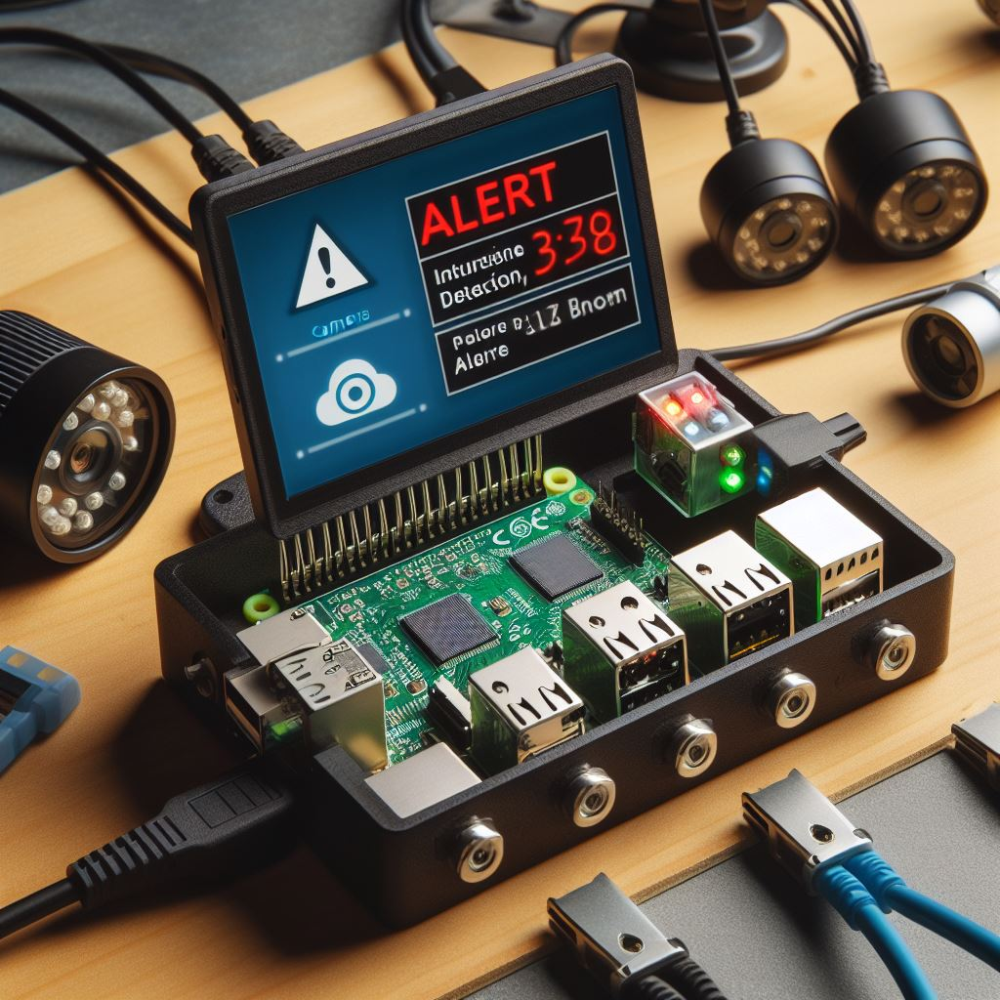

# Dokumentation

Bild von Bing generiert: [Suchen</title><meta content="Finden Sie Bilder, Fotos und animierte GIFs mit Bing Bilder" name="description" /><title>Bilder](https://www.bing.com/images/create/intrusion-detection-raspberrypi/1-6579be6948a14dbdab119cddd71c0c67?id=DfTnKrjy7FJxcz%2BHxST3Kw%3D%3D&view=detailv2&idpp=genimg&idpclose=1&FORM=SYDBIC) Prompt: "Geeriere mir bitte ein Bild für ein Projekt. Das Projekt heißt "Intrusion Detection RaspberryPi""

## Einleitung

### Motivation

Unser Ziel war es, ein Gerät zu entwerfen, welches einen oder mehrere Server auf Angriffe untersucht und diese eventuell sogar schon vorbeugt. Das Gerät sollte dabei möglichst einfach einzubauen sein, ohne große Änderungen am bestehenden System vornehmen zu müssen.

## Anforderungen

Im folgenden sind die Anforderungen beschrieben, die wir uns für unser Projekt gesetzt haben.

### Unabdingliche Anforderungen

#### File Based Intrusion Detection

Ein erfolgreicher Angriff hinterlässt spuren im System. Diese können sehr gut versteckt werden, etwa im Code von bestehenden Anwendungen. Das Tool "aide" kann solche Angriffe jedoch aufdecken. Da dies einen sehr großen Teil von ausgeführten Angriffen erkennen kann, war dies uns sehr wichtig.

#### Network Intrusion Detection

Bevor ein Angriff lokale Dateien verändern kann, muss der Angreifer (meistens) erst über das Netzwerk gehen. Wird der Angriff schon dort erkannt, kann dieser schon schneller verhindert werden, und so etwa der Raub von Daten oder anderem verhindert werden. Aus diesem Grund war es uns sehr wichtig, auch diesen Teil mit unserem Projekt abzudecken.

#### Benachrichtigungen

Wurde ein Angriff entdeckt, sollte gehandelt werden. Was genau zu tun ist, ist oft äußerst komplex und individuell, dazu braucht es einen erfahreneren Systemadministrator. Damit dieser aber von dem Problem erfährt, ist es wichtig, dass dieser über verdächtige Aktionen benachrichtigt wird.

### Optionale Anforderungen

#### Oberflächen

##### Evebox

Evebox ist ein Suricata Alert- und Eventmanagement Tool für die Suricata IDS/NSM-Engine. Wir haben das Tool erweitert, um auch die Warnungen von AIDE anzeigen zu können.

#### Pi-Hole

Viele Website, über die schädliche Handlungen geschehen sind bekannt. Mit Pi-Hole kann verhindert werden, dass der Server überhaupt auf diese zugreift. Sei es durch Manipulation oder sozial Engineering.

## Verwendete Technologien

### SSH

SSH bietet eine einfache und sichere Verbindung. Deswegen nutzen wir diese, um Befehle auf dem Server von unserem Gerät auszuführen. Zudem wird SSH zum Übertragen von Dateien eingesetzt.

### Raspberry Pi

Ein Raspberry Pi ist ein ARM-basierter Einplatinencomputer mit einem Ein-Chip-System von Broadcom. Er ist klein und weit verbreitet, deswegen bietet er sich sehr gut an, um die Basis für unser Projekt zu sein. Auch Technologien wie Pi-Hole waren darauf einfach umzusetzen.

### File Based Intrusion Detection: AIDE

AIDE kann Veränderungen in Dateien und Ordnern entdecken, die sonst untergehen könnten. Außerdem erkennt es neue oder gelöschte Dateien und Ordner. Dies geschieht, indem Hashwerte für ausgewählte Ordner (und ihre Inhalte) erstellt werden und in einer Datenbank abgespeichert werden. Zu einem späteren Zeitpunkt kann dann mit dieser verglichen werden und Veränderungen können entdeckt werden. Wie nutzen wir dies?

Vorab der kompakte Ablauf, später mehr Details und Herausforderungen und ihre Lösungen.

AIDE läuft bei uns als Cronjob jeden Morgen um 2:00.
Bei der ersten Ausführung von Aide auf einem Host wird eine Datenbank erstellt. Bei jeder weiteren wird auch eine Datenbank für dem momentanen Stand erstellt und mit der vor 24 Stunden verglichen.
Die erkannten Veränderungen werden dann in geloggt und per Mail Versand, beziehungsweise im JSON-Format in eine Logdatei geschrieben, welche Evebox darstellt.

#### Ausführung von Aide

Die Berechnung der Hashwerte ist aufwendig. Deswegen sollte dies zu einem Zeitpunkt getan werden, in dem der Host Ressourcen zur Verfügung hat. Der Raspberry startet deswegen jeden Tag ab 2:00 auf dem Host die Erstellung der Datenbank. 

#### Persistenz der Datenbanken und Konfigurationsdateien

Die Datenbanken werden auf dem Host erstellt. Von diesem gehen wir jedoch als nicht sicher aus. Deswegen sollten hier Daten nicht gespeichert werden. Denn leiern, Host, könnte er dies ja wieder verschleiern, was wir zu verhindern versuchen. Deswegen werden alle Datenbanken und die Konfigurationsdateien auf dem Raspberry gespeichert. Die letzte Datenbank wird dann immer wieder auf den Host hochgeladen um vergleichen werden zu können.

#### erstellen der Konfigurationsdateien

Mit Aide kann und sollte individuell festgelegt werden, welche Ordner betrachtet werden. Werden dies irgendwann viele Ordner, kann dieser Prozess sehr aufwendig und Zeitintensiv werden. Genau deswegen sollte hier eine gute Auswahl getroffen werden, besonders weil aide keine Priorisierung der Änderungen durchführt.
Der Nutzer sieht also immer alle Änderungen. Werden also etwa log-files betrachtet, die sich oft Ändern und auch viele neue hinzukommen, flutet dies die Ausgabe und wichtige Änderungen könnten übersehen werden.
Sehr gut eignen sich deswegen ausführbare Dateien.

#### Versand per Mail

Um auch über die Änderungen informiert zu werden, lesen wir den output von Aide mit einem python-script aus und passen diese an die Ausgaben von suricata an, um hier gute Übersicth für den Nutzer zu schaffen.
Die Events der letzten 24h werden dann per Mail an die hinterlegte Addresse versendet.

### Network Intrusion Detection

Um Angriffe frühzeitig zu erkennen, insbesondere bevor sie lokale Dateien verändern können, setzen wir auf Network Intrusion Detection (NID) mit Suricata. Suricata ist eine leistungsfähige Open-Source-Software, die Netzwerkverkehr analysiert und nach potenziell schädlichem Verhalten sucht. 

#### Funktionsweise von Suricata

Suricata arbeitet auf der Ebene des Netzwerkverkehrs und überwacht den Datenfluss in Echtzeit. Dabei nutzt es verschiedene Methoden, um Anomalien oder verdächtige Aktivitäten zu identifizieren:

1. **Signature-based Detection:** Suricata verwendet vordefinierte Signaturen, um bekannte Angriffsmuster zu erkennen. Diese Signaturen werden regelmäßig aktualisiert, um gegen die neuesten Bedrohungen gewappnet zu sein.

2. **Anomaly-based Detection:** Durch die Analyse von Netzwerkverhalten erkennt Suricata auch ungewöhnliche Muster, die auf potenzielle Angriffe hindeuten können. Dies ermöglicht die Entdeckung neuer oder sich entwickelnder Bedrohungen.

3. **Protocol Detection:** Suricata erkennt und überwacht verschiedene Netzwerkprotokolle, um Abweichungen von den erwarteten Standards zu identifizieren.

#### Integration in die bestehende Infrastruktur

Bei der Integration in die bestehende Infrastruktur eines Netzwerks gab es zahlreiche Herausforderungen. Suricata sollte den gesamten Datenverkehr des Servers analysieren können, jedoch sollte der Server nicht von dem Raspberry als Knotenpunkt abhängig sein. Hierzu hat unsere Gruppe drei verschiedene Herangehensweisen erarbeitet

**\# TODO:** Herangehensweisen aus [Unexpected problem](../network-ids/Steps.md#unexpected-problem) mit Bildern vorstellen

Unsere gruppe entschied sich für die erste Variante und nutzte die IPTables Erweiterung `tee` um eine Kopie aller eingehender Pakete an den PI zu senden. Selbst wenn dieser ausfällt, arbeitet der Server unbeeinflusst weiter.

**Known Bugs and Limitations:**

Durch die Verwendung der Tee-Erweiterung entsteht ein Bug auf dem Server: `BUG: using __this_cpu_write() in preemptible [00000000] code: sshd/1030`. Dieser Bug kommt, entgegen der angezeigten Nachricht, nicht von dem hier angegebenen `sshd`-Prozess (könnte auch jeder andere Prozess sein, welcher den Network-Stack verwendet), sondern von einem Bug im Kernel-Modul Netfilter. Genaueres konnten wir nicht herausfinden, jedoch liegt die Ursache irgendwo in [linux/net/ipv4/netfilter/nf_dup_ipv4.c at master · torvalds/linux (github.com)](https://github.com/torvalds/linux/blob/master/net/ipv4/netfilter/nf_dup_ipv4.c#L86). Das Fixen des Problems im Linux-Kernel-Modul Netfilter und neu bauen des Kernels würde den Ramen dieser Projektarbeit sprengen und da das Projekt trotz dieses unerwünschten Nebeneffektes funktioniert, wird dieser zum Zeitpunkt der Abgabe ignoriert.

**#TODO:** Links: [Home - Suricata](https://suricata.io/) [Man page of iptables-extensions (netfilter.org)](https://ipset.netfilter.org/iptables-extensions.man.html) [BUG: using __this_cpu_write() in preemptible [00000000] code: systemd-udevd/497 (kernel.org) (TODO: TO CHECK)](https://lore.kernel.org/all/8761m7lm3j.fsf@canonical.com/T/#u)

### Intrusion Prevention

Besser als einen Angriff zu entdecken, ist ihn zu verhindern. Die allermeisten Angriffe finden über das Internet statt und oft genug sind dabei bereits bekannte Webseiten im Spiel. Das Blocken von solch bekannten Webseiten kann Angriffe verhindern, bevor sie überhaupt stattgefunden haben. Dazu wird der Server so konfiguriert, dass er seine DNS-Auflösung über den Rapsberry Pi abhandelt. Dieser kann dann mit der Technologie "PiHole" Websites blockieren. Für dieses gibt es umfangreiche Listen mit bekannten, potenziell schädlichen Websites und RegEx-Filter, welche beispielsweise URLS, welche auf `.exe` enden oder nicht Lateinische Buchstaben (`'o' U+006F` aus den Lateinischen Buchstaben und `'ο' U+03BF` aus den griechischen Buchstaben) enthalten blockieren.

### Sonstiges

- **IPTables:** Zusätzlich wurde zum Umgang mit dem Netfilter-Modul das Userspace-Programm IPTables verwendet. Dieses leitet beispielsweise alle eingehenden Pakete auf dem PI durch Suricata und sendet eine Kopie aller Pakete auf dem Server an den Pi.

- **Cron:** Der Cron-Deamon dient der zeitbasierten Ausführung von Prozessen. Dieser führt täglich die Überprüfung des Servers durch AIDE durch.

- **Samba:** Dient der zur Verfügung Stellung von Netzwerk-Ressourcen.

- **systemd-resolved:** Dient dem manuellen Anpassen der `/etc/resolve.conf`, welche den PI als DNS-Server deklariert.