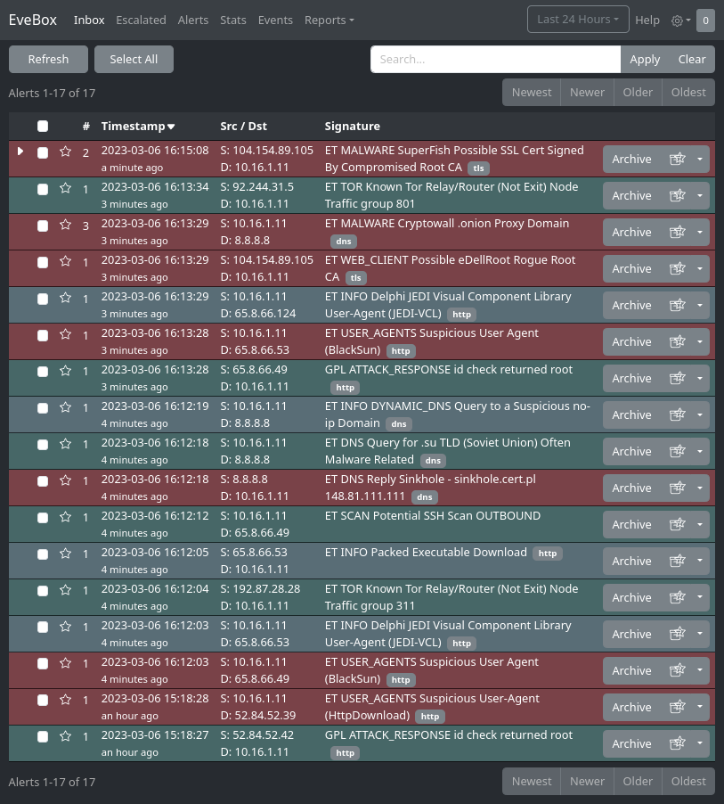
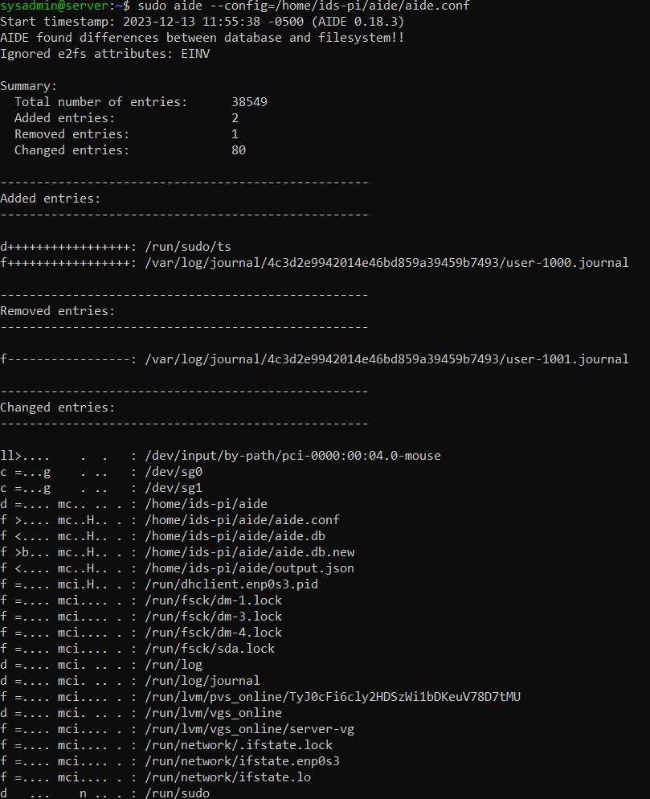
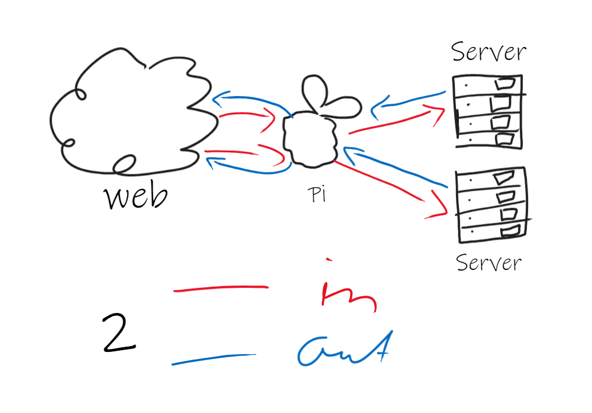
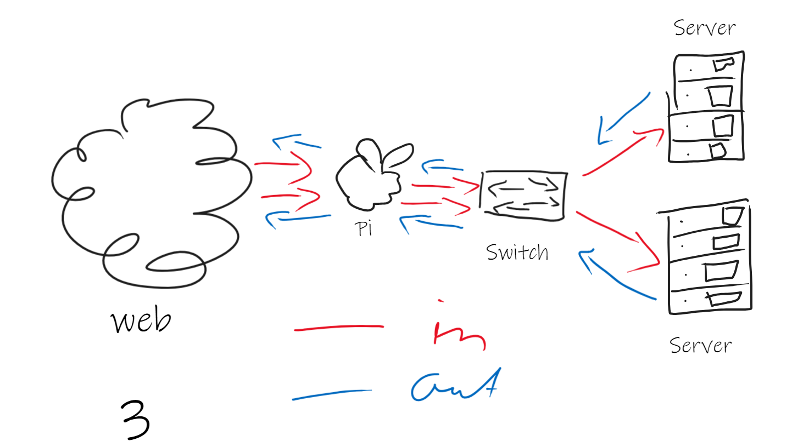
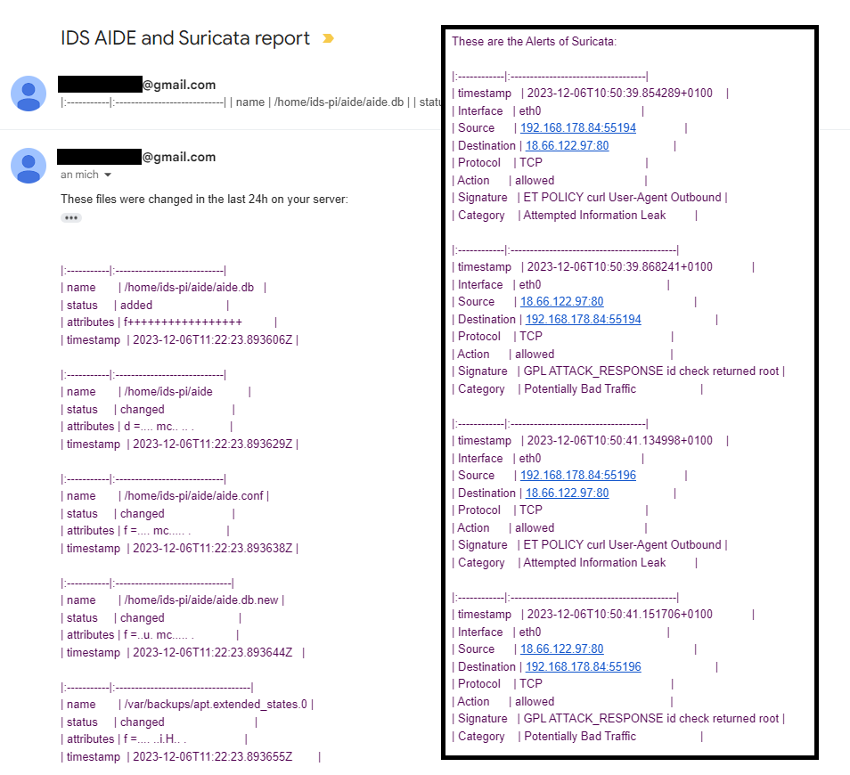
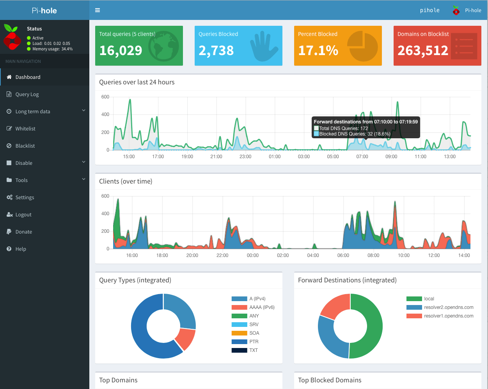

# Dokumentation

Bild von Bing generiert: [Suchen<title><meta content="Finden Sie Bilder, Fotos und animierte GIFs mit Bing Bilder" name="description" /></title>Bilder](https://www.bing.com/images/create/intrusion-detection-raspberrypi/1-6579be6948a14dbdab119cddd71c0c67?id=DfTnKrjy7FJxcz%2BHxST3Kw%3D%3D&view=detailv2&idpp=genimg&idpclose=1&FORM=SYDBIC) Prompt: "Generiere mir bitte ein Bild für ein Projekt. Das Projekt heißt "Intrusion Detection RaspberryPi"

## Einleitung

### Motivation

Unser Ziel war es, ein Gerät zu entwerfen, welches einen oder mehrere Server auf Angriffe untersucht und diese eventuell sogar schon vorbeugt. Das Gerät sollte dabei möglichst einfach einzubauen sein, ohne große Änderungen am bestehenden System vornehmen zu müssen.

## Anforderungen

Im folgenden sind die Anforderungen beschrieben, die wir uns für unser Projekt gesetzt haben.

### Unabdingliche Anforderungen

#### File Based Intrusion Detection

Ein erfolgreicher Angriff hinterlässt spuren im System. Diese können sehr gut versteckt werden, etwa im Code von bestehenden Anwendungen. Das Tool "AIDE" kann solche Angriffe jedoch aufdecken. Da dies einen sehr großen Teil von ausgeführten Angriffen erkennen kann, war dies uns sehr wichtig.

#### Network Intrusion Detection

Bevor ein Angriff lokale Dateien verändern kann, muss der Angreifer (meistens) erst über das Netzwerk gehen. Wird der Angriff schon dort erkannt, kann dieser schon schneller verhindert werden, und so etwa der Raub von Daten oder anderem verhindert werden. Aus diesem Grund war es uns sehr wichtig, auch diesen Teil mit unserem Projekt abzudecken.

#### Benachrichtigungen

Wurde ein Angriff entdeckt, sollte gehandelt werden. Was genau zu tun ist, ist oft äußerst komplex und individuell, dazu braucht es einen erfahreneren Systemadministrator. Damit dieser aber von dem Problem erfährt, ist es wichtig, dass dieser über verdächtige Aktionen benachrichtigt wird.

### Optionale Anforderungen

#### Oberflächen

##### Evebox

Evebox ist ein Suricata Alert- und Eventmanagement Tool für die Suricata IDS/NSM-Engine. Wir haben das Tool erweitert, um auch die Warnungen von AIDE anzeigen zu können.

Viele Webseiten, über die schädliche Handlungen geschehen sind bekannt. Mit Pi-Hole kann verhindert werden, dass der Server überhaupt auf diese zugreift. Das fällt unter Intrusion Prevention.

Bild von [EveBox | EveBox](https://evebox.org/)

##### Pi-Hole

Viele Website, über die schädliche Handlungen geschehen sind bekannt. Mit Pi-Hole kann verhindert werden, dass der Server überhaupt auf diese zugreift. Sei es durch Manipulation oder sozial Engineering.

## Verwendete Technologien

### SSH

SSH bietet eine einfache und sichere Verbindung. Deswegen nutzen wir diese, um Befehle auf dem Server von unserem Gerät auszuführen. Zudem wird SSH zum Übertragen von Dateien eingesetzt.

### Raspberry Pi

Bild von: [RASPBERRY_PI_3B_PLUS_001.png (3000×2062) (cdn-reichelt.de)](https://cdn-reichelt.de/bilder/web/xxl_ws/A300/RASPBERRY_PI_3B_PLUS_001.png)

Ein Raspberry Pi ist ein ARM-basierter Einplatinencomputer mit einem Ein-Chip-System von Broadcom. Er ist klein und weit verbreitet, deswegen bietet er sich sehr gut an, um die Basis für unser Projekt zu sein. Auch Technologien wie Pi-Hole waren darauf einfach umzusetzen.

### File Based Intrusion Detection: AIDE

AIDE kann Veränderungen in Dateien und Ordnern entdecken, die sonst untergehen könnten. Außerdem erkennt es neue oder gelöschte Dateien und Ordner. Dies geschieht, indem Hashwerte für ausgewählte Ordner (und ihre Inhalte) erstellt werden und in einer Datenbank abgespeichert werden. Zu einem späteren Zeitpunkt kann dann mit dieser verglichen werden und Veränderungen können entdeckt werden. Wie nutzen wir dies?

Vorab der kompakte Ablauf, später mehr Details und Herausforderungen und ihre Lösungen.

AIDE läuft bei uns als Cronjob jeden Morgen um 2:00.
Bei der ersten Ausführung von Aide auf einem Host wird eine Datenbank erstellt. Diese enthält Haswerte für Dateien und Ordner. Bei jeder weiteren Ausführung wird auch eine Datenbank für dem momentanen Stand erstellt und mit der vor 24 Stunden verglichen.
Die erkannten Veränderungen werden dann geloggt und per Mail versand, beziehungsweise im JSON-Format in eine Logdatei geschrieben, welche Evebox darstellt.

#### Ausführung von Aide

Die Berechnung der Hashwerte ist aufwendig. Deswegen sollte dies zu einem Zeitpunkt gemacht werden, in dem der Host Ressourcen zur Verfügung hat. Der Raspberry startet deswegen jeden Tag ab 2:00  die Erstellung der Datenbanken auf den Hosts.

#### Persistenz der Datenbanken und Konfigurationsdateien

Die Datenbanken werden auf dem Host erstellt, von diesem gehen wir jedoch als nicht sicher aus. Deswegen sollten hier Daten nicht gespeichert werden. Denn hätte ein Angreifer sich Zugriff auf den Host verschafft, könnte er dies ja wieder verschleiern, was wir zu verhindern versuchen. Deswegen werden alle Datenbanken und die Konfigurationsdateien auf dem Raspberry Pi gespeichert. Die letzte Datenbank und Konfigurationsdatei wird bei jedem Ausführen von AIDE wieder auf den Host hochgeladen um damit zu arbeiten.
Um zu verhindern, dass der Angreifer die packages von AIDE verändert, verifizieren wir diese vor jeder Ausführung auf den jeweiligen Hosts und geben eine entsprechende Fehlermeldung zurück.

#### Erstellen der Konfigurationsdateien

Mit Aide kann und sollte individuell festgelegt werden, welche Ordner betrachtet werden. Werden dies irgendwann viele Ordner, kann dieser Prozess sehr aufwendig und Zeitintensiv werden. Genau deswegen sollte hier eine gute Auswahl getroffen werden, besonders weil AIDE keine Priorisierung der Änderungen durchführt.
Der Nutzer sieht also immer alle Änderungen. Werden also etwa log-files betrachtet, die sich oft Ändern und auch viele neue hinzukommen, flutet dies die Ausgabe und wichtige Änderungen könnten übersehen werden.
Sehr gut eignen sich deswegen ausführbare Dateien. Diese Ändern sich selten, etwa nur bei Updates. Außerdem sind diese ein sehr interessantes Ziel für Angreifer.

#### Versand per Mail

Um auch über die Änderungen informiert zu werden, lesen wir den Output von AIDE mit einem Python-Skript aus und passen diese an die Ausgaben von Suricata an, um hier gute Übersicht für den Nutzer zu schaffen.
Die Events der letzten 24h werden dann per Mail an die hinterlegte Adresse versendet.

### Network Intrusion Detection: Suricata

Bild von [Logo-FINAL_Vertical_Color_Whitetext.png (1055×867) (suricata.io)](https://suricata.io/wp-content/uploads/2021/01/Logo-FINAL_Vertical_Color_Whitetext.png)

Um Angriffe frühzeitig zu erkennen, insbesondere bevor sie lokale Dateien verändern können, setzen wir auf Network Intrusion Detection (NID) mit Suricata. Suricata ist eine leistungsfähige Open-Source-Software, die Netzwerkverkehr analysiert und nach potenziell schädlichem Verhalten sucht. 

#### Funktionsweise von Suricata

Suricata arbeitet auf der Ebene des Netzwerkverkehrs und überwacht den Datenfluss in Echtzeit. Dabei nutzt es verschiedene Methoden, um Anomalien oder verdächtige Aktivitäten zu identifizieren:

1. **Signature-based Detection:** Suricata verwendet vordefinierte Signaturen, um bekannte Angriffsmuster zu erkennen. Diese Signaturen werden regelmäßig aktualisiert, um gegen die neuesten Bedrohungen gewappnet zu sein.

2. **Anomaly-based Detection:** Durch die Analyse von Netzwerkverhalten erkennt Suricata auch ungewöhnliche Muster, die auf potenzielle Angriffe hindeuten können. Dies ermöglicht die Entdeckung neuer oder sich entwickelnder Bedrohungen.

3. **Protocol Detection:** Suricata erkennt und überwacht verschiedene Netzwerkprotokolle, um Abweichungen von den erwarteten Standards zu identifizieren.

#### Integration in die bestehende Infrastruktur

Bei der Integration in die bestehende Infrastruktur eines Netzwerks gab es zahlreiche Herausforderungen. Suricata sollte den gesamten Datenverkehr des Servers analysieren können, jedoch sollte der Server nicht von dem Raspberry als Knotenpunkt abhängig sein. Hierzu hat unsere Gruppe drei verschiedene Herangehensweisen erarbeitet: 

1. **Direkte Verbindung zum Server aus dem Netzwerk**
   
   - Pro: Es ist nicht notwendig auszuwählen, welchen Server wir verwenden, da dies durch die IP-Adresse festgelegt ist.
   
   - Kontra: Das IDS wird keinen Verkehr sehen und würde nur den ausgehenden Verkehr scannen => nicht wirklich hilfreich.
   
   - Idee: Verwendung von IPTables, um den gesamten Ein- und Ausgangsverkehr zunächst über den Pi zu routen?
     
     

2. **Verwendung des Pi als "Proxy":** Den Raspberry Pi als Gateway nach Außen und von außen sein IP-Adresse freigeben
   
   - Pro: Ich weiß, wie es geht, und es könnte wirklich einfach sein.
   
   - Kontra: Wie kann man feststellen, welche Verbindungen für den Pi und welche für den Server sind (zum Beispiel: SSH-Verbindung zum Pi oder zum Server)?
   
   - Kontra: Wie kann man feststellen, welchen Pakete an welchen Server weitergeleitet werden sollen, wenn wir mehrere verbundene Server haben?
   
   - Idee: Pi als Reverse Proxy verwenden?
     
     

3. **Erstellen eines eigenen Subnetzes, hinzufügen einer Route zu diesem Netzwerk auf dem Router, um über den Pi darauf zuzugreifen.**
   
   - Pro: Könnte sehr einfach sein.
   
   - Pro: Leicht festzustellen, auf welchen Server zugegriffen werden soll.
   
   - Kontra: Wir haben nur eine LAN-Schnittstelle (normalerweise, wenn wir keinen zusätzlichen Adapter verwenden möchten).
   
   - Idee: Einem Adapter mehrere Adressen zuweisen und leiten den gesamten Verkehr zu diesem Subnetz weiterleiten.
     
     

Unsere gruppe entschied sich für die erste Variante und nutzte die IPTables Erweiterung `tee` um eine Kopie aller eingehender Pakete an den PI zu senden. Selbst wenn dieser ausfällt, arbeitet der Server unbeeinflusst weiter.

**Known Bugs and Limitations:**

Durch die Verwendung der Tee-Erweiterung entsteht ein Bug auf dem Server: `BUG: using __this_cpu_write() in preemptible [00000000] code: sshd/1030`. Dieser Bug kommt, entgegen der angezeigten Nachricht, nicht von dem hier angegebenen `sshd`-Prozess (könnte auch jeder andere Prozess sein, welcher den Network-Stack verwendet), sondern von einem Bug im Kernel-Modul Netfilter. Genaueres konnten wir nicht herausfinden, jedoch liegt die Ursache irgendwo in [linux/net/ipv4/netfilter/nf_dup_ipv4.c at master · torvalds/linux (github.com)](https://github.com/torvalds/linux/blob/master/net/ipv4/netfilter/nf_dup_ipv4.c#L86). Das Fixen des Problems im Linux-Kernel-Modul Netfilter und neu bauen des Kernels würde den Ramen dieser Projektarbeit sprengen und da das Projekt trotz dieses unerwünschten Nebeneffektes funktioniert, wird dieser zum Zeitpunkt der Abgabe ignoriert.

**#TODO:** Links: [Home - Suricata](https://suricata.io/) [Man page of iptables-extensions (netfilter.org)](https://ipset.netfilter.org/iptables-extensions.man.html) [BUG: using __this_cpu_write() in preemptible [00000000] code: systemd-udevd/497 (kernel.org) (TODO: TO CHECK)](https://lore.kernel.org/all/8761m7lm3j.fsf@canonical.com/T/#u)

#### Versand per Mail

Um über sogenannte Alerts informiert zu werden, lesen wir, ähnlich wie bei AIDE auch, die Lg-Dateien von Suricata mittels eines Python-Skriptes aus und generieren eine E-Mail.
Die Events der letzten 24h werden dann per Mail an die hinterlegte Adresse versendet.

### E-Mail

Damit ein Systemadministrator Standortunabhängig benachrichtigt werden kann, sind Mails ein sehr guter Weg. Hier gibt es auch schon sehr viele gegebene Möglichkeiten, diese über das Terminal zu versenden. Hier nutzen wir SSMTP. Um mails zu versenden muss eine Textdatei erstellt werden, die eine bestehende Mail-Adresse und ein zugehöriges Secret enthält. Dann können Mails sehr einfach versendet werden.

### Intrusion Prevention

Bild von Wikipedia: Von Pi-hole - https://i2.wp.com/pi-hole.net/wp-content/uploads/2018/04/Screenshot-2018-04-01-14.39.10.png, Gemeinfrei, https://commons.wikimedia.org/w/index.php?curid=71217077

Besser als einen Angriff zu entdecken, ist ihn zu verhindern. Die allermeisten Angriffe finden über das Internet statt und oft genug sind dabei bereits bekannte Webseiten im Spiel. Das Blocken von solch bekannten Webseiten kann Angriffe verhindern, bevor sie überhaupt stattgefunden haben. Dazu wird der Server so konfiguriert, dass er seine DNS-Auflösung über den Raspberry Pi abhandelt. Dieser kann mit der Technologie "Pi-Hole" Websites blockieren. Für dieses gibt es umfangreiche Listen mit bekannten, potenziell schädlichen Websites und RegEx-Filter, welche beispielsweise URLS, welche auf `.exe` enden oder nicht Lateinische Buchstaben (`'o' U+006F` aus den Lateinischen Buchstaben und `'ο' U+03BF` aus den griechischen Buchstaben) enthalten blockieren.

### Sonstiges

- **IPTables:** Zusätzlich wurde zum Umgang mit dem Netfilter-Modul das Userspace-Programm IPTables verwendet. Dieses leitet beispielsweise alle eingehenden Pakete auf dem PI durch Suricata und sendet eine Kopie aller Pakete auf dem Server an den Pi.

- **Cron:** Der Cron-Deamon dient der zeitbasierten Ausführung von Prozessen. Dieser führt täglich die Überprüfung des Servers durch AIDE durch.

- **Samba:** Dient der zur Verfügung Stellung von Netzwerk-Ressourcen. Beim Teilen von Daten hierüber musste beachtet werden, dass die Samba-Ordner beschrieben werden können und potenziell auch überschrieben werden können. Die Daten, die der Raspberry davon braucht werden also in einen anderen Ordner verschoben.

- **systemd-resolved:** Dient dem manuellen Anpassen der `/etc/resolve.conf`, welche den PI als DNS-Server deklariert.

- **Python:** Ist eine sehr mächtige und einfach zu erlernende Scriptsprache. In diesem Projekt, wird sie zum Verarbeiten von Daten verwendet, beispielsweise beim Vorbereiten der Mails und verarbeiten der AIDE-Log-Dateien.

## Implementierung

### Auf dem Raspberry PI

Die Installation eines IDS-PI ist komplexer und nicht so automatisiert wie für einen server, muss aber auch deutlich seltener durchgeführt werden. Wichtig ist, dass der Zugang zu diesem geschützt ist, da secrets wie private ssh-keys für hochwertige Zugänge auf die server oder Tokens für Mail-Addressen auf diesem gepsichert werden.

Auf dem PI müssen bash-scripts und Konfigurationsdateien abgelegt werden, die wir erstellt haben. Aßerdem müssen cronjobs aufgesetzt werden, die diese ausführen. Für etwa die Installation von Suricata werden weitreichende Berechtigungen benötigt.

Den fertig eingerichteten IDS-Pi in das vorhandene Netz zu integrieren ist sehr einfach. Wenn er mittels LAN verbunden ist, versucht er sich automatisch eine IP mittels DHCP zu holen. Es wäre sinnvoll, ihm beim Router eine feste IP zuzuweisen, da, wenn sich die IP ändert, die hinzugefügten Server mittels AIDE und Pi-Hole nicht mehr überwacht werden. Er fängt automatisch an, alle ihm zugesendeten Pakete mittels Suricata zu analysieren und das Pi-Hole überwacht automatisch alle DNS-Anfragen, welche es bekommt. Zudem überprüft er alle 24 Stunden, ob neue Server für AIDE dazugekommen sind und initialisiert diese automatisch. Im Anschluss werden sie alle 24 Stunden mit AIDE überprüft.

### Auf dem Server

Die Installation auf dem Server wurde mittels eines Installationsskriptes automatisiert. Hier ist es wichtig, dass der Server während der Installation dauerhaft mit dem Internet verbunden bleibt.

## Fazit

### Evaluation der Arbeit

Es war uns möglich sowohl alle Unabdinglichen, als auch alle Optionalen Anforderungen auf die Ein- oder andere Weise zu erfülle. Beispielsweise hatten wir anfangs vor, NIDS über das Pi-Hole laufen zu lassen, oder zu evaluieren, von welchen Dateien wir schon eine Hashsumme haben via Trusted Timestamping. Jedoch haben sich beiden Technologien im Laufe des Projekts für diesen Anwendungsfall als nicht geeignet herausgestellt.

Zudem haben uns vorgenommen, den IDS-Pi auf dem Server einfach und ohne große Änderungen auf dem Server als auch in der vorhandenen Infrastruktur vorzunehmen, zu integrieren. Leider ist uns das nur teilweise gelungen. Durch die Verwendung eines automatisierten Skriptes ist es sehr einfach den Server mit dem IDS-Pi zu verbinden. Auch die Installation eines (fertig eingerichteten) IDS-Pi in einem vorhandenen System ist sehr einfach (Plug and Play) möglich, jedoch verwenden wir sehr viel zusätzliche Software auf dem Server, welche teilweise sehr tief in das System eingreift (Beispiel: IPTables). Auch das Skript ist  zwar voll funktionsfähig, jedoch toleriert es keine Fehler (Beispielsweise wenn die Internetverbindung während der Installation abbricht) und nach fehlerhafter Ausführung ist es sehr mühsam, das Skript fortzusetzen oder die Änderungen rückgängig zu machen.

### Blick in die Zukunft

Wir möchten die Einrichtung des IDS-Pi mittels eines Debian-Packages vereinfachen. Dieses könnte man mittels des APT Paketmanagers installieren und hätte einen voll funktionsfähigen IDS-Pi.

Auch in den Bug bei den Netfiltern würden wir uns gerne tiefer einarbeiten und eventuell eine praktikable Lösung finden.

Des weitern wäre hier auch sehr nützlich, wenn anhand der erkannten Daten auch automatisch gehandelt werden kann. Etwa bestimmte IP-Addressen zu blockieren, oder den Server herunterzufahren. 

Zuletzt haben wir uns angeschaut, wie man den Raspberry mittels eines Read-Only-Dateisystems und IPTables regeln robuster machen könnte.

## Literaturverzeichnis

## Abbildungsverzeichnis

## Anlagen

- Eigenständigkeitserklärung

- Quellen