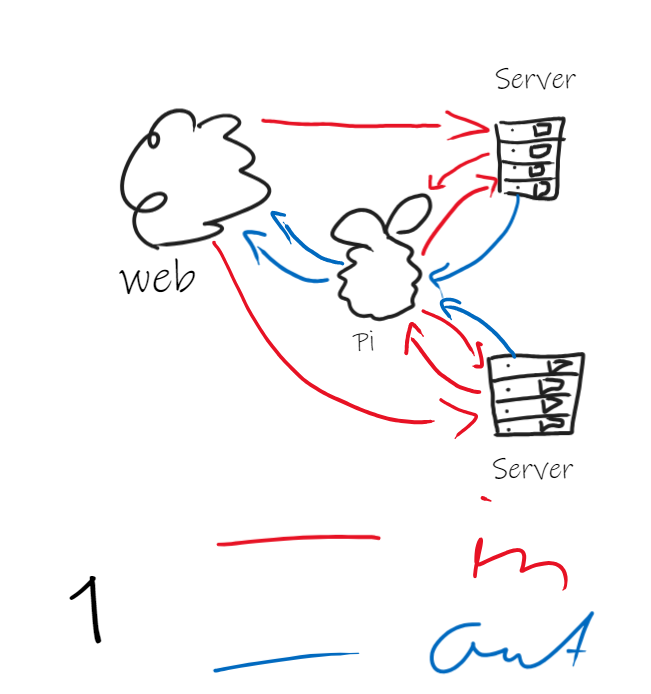
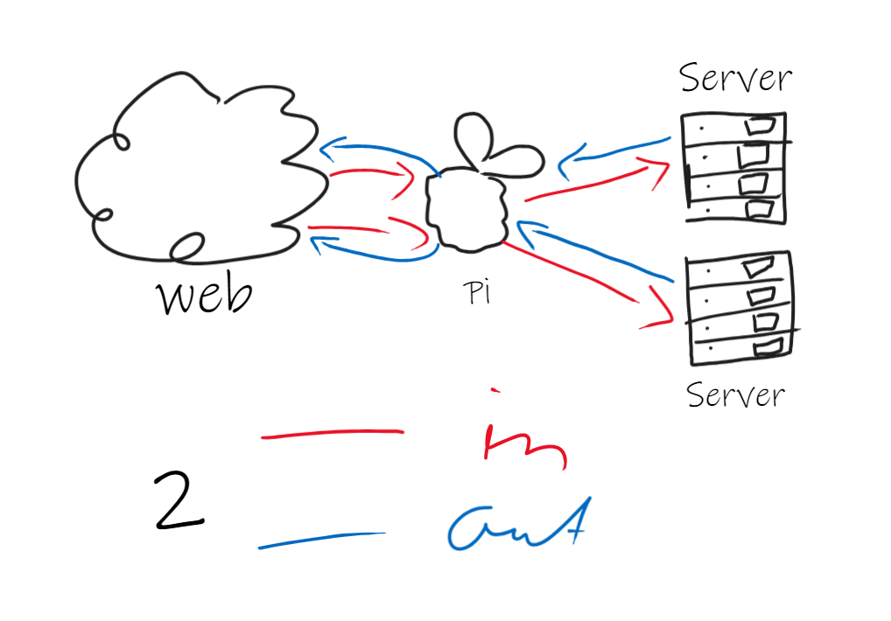
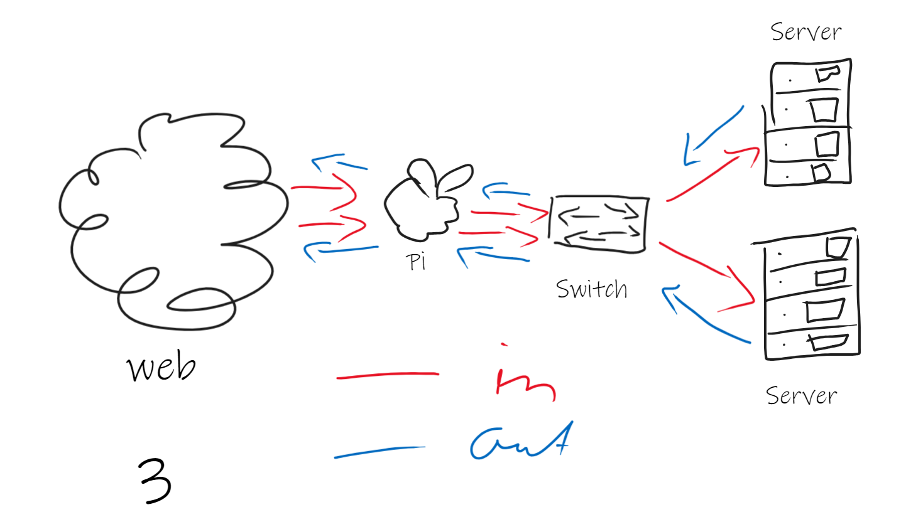

# Steps

Hint: Server will be configured in [install-script](../install-script/Steps.md)

[TOC]

## Installing Suricata

Using a combination of [2. Quickstart guide — Suricata 7.0.3-dev documentation](https://docs.suricata.io/en/latest/quickstart.html), [3. Installation — Suricata 7.0.3-dev documentation](https://docs.suricata.io/en/latest/install.html#debian), [How-To: Installing Suricata in Ubuntu from PPA - YouTube](https://www.youtube.com/watch?v=zBlYESOSqpY&list=PLFqw30a25lWRIhAnQNb7ZaPpexPYgxhVv&index=2) and [Installing & Configuring Suricata - YouTube](https://www.youtube.com/watch?v=UXKbh0jPPpg)

```bash
sudo su -
# Get Distro
cat /etc/*-release

# Replace <distro> with actual distro
echo "deb http://http.debian.net/debian <distro>-backports main" > \
    /etc/apt/sources.list.d/backports.list
apt-get update
apt-get install suricata -t <distro>-backports

# Autostart
systemctl enable suricata

# Optional: Stop while setting up
systemctl stop suricata
exit

# surica-update sets up directories and fetches some default rules
sudo suricata-update
```

## Setting up sources

```bash
sudo suricata-update list-sources
# select wanted sources
# Commercial do need subscription. MIT or open-source are free. Default will be automatically installed
# mine:
# - malsilo/win-malware
# - oisf/trafficid
# - et/open
sudo suricata-update enable-source <name>
sudo suricata-update
```

## Configuring Suricata

```bash
# Optional: Stop while setting up
sudo systemctl stop suricata

# Get interfaces and addresses
ip address show
```

Edit Config `/etc/suricata/suricata.yaml`

(Hint `:set number` shows line-numbers; With `/` can be searched)

Things to change:

- `HOME_NET` should be as specific as possible. In my case, my Pi has only one network. It's IP and SNM is `192.168.178.84/24`, so here all we have is `"[192.168.178.0/24]"`

- `af-packet` specially `- interface` should be your interface. In my case, it's `eth0`

- `pcap` specially `-interface` same as above

- `community-id` should be `true`. For more information, see [17.1.1. Eve JSON Output — Suricata 7.0.3-dev documentation](https://docs.suricata.io/en/latest/output/eve/eve-json-output.html#community-flow-id)

- `default-rule-path` should be `/var/lib/suricata/rules` because `suricata-update` saves rules in there for some reason

- in `rule-files` can be a path, like `/etc/suricata/rules/local.rules` if needed (new point with `-`)

Testing config:

```bash
sudo suricata -T -c /etc/suricata/suricata.yaml -v
```

## Testing suricata:

1. `sudo cat /var/log/suricata/fast.log` (should be empty)

2. `curl http://testmynids.org/uid/index.html`

3. Command from 1 should now look like this:
   
   ```text
   10/23/2023-18:08:24.838154  [**] [1:2013028:7] ET POLICY curl User-Agent Outbound [**] [Classification: Attempted Information Leak] [Priority: 2] {TCP} 192.168.178.84:44064 -> 18.66.122.21:80
   10/23/2023-18:08:24.853327  [**] [1:2100498:7] GPL ATTACK_RESPONSE id check returned root [**] [Classification: Potentially Bad Traffic] [Priority: 2] {TCP} 18.66.122.21:80 -> 192.168.178.84:44064
   ```

## Traffic forwarding

That the clients have internet, the Raspberry needs to be configurated to forward the Traffic.

1. Install IPTables:
   
   ```bash
   sudo apt instal iptables
   ```

2. **Accept incoming Connections**:  Make sure, that incoming connections for already made connections and for local access to the Raspberry are accepted. Usually, this is already configurated. To test use `iptables -L INPUT`

3. **Activate forwarding**: To use the Raspberry as Gateway, we need to activate IP-Forwarding:
   
   Edit `/etc/sysctl.conf`
   
   Search for `#net.ipv4.ip_forward=1` and uncomment it
   
   Save

4. Apply changes: 
   
   ```bash
   sudo sysctl -p /etc/sysctl.conf
   ```

5. **NAT-Konfiguration (Network Address Translation)**: Add a NAT-Rule in IPTABLES, to route outgoing connections over the pi.
   
   ```bash
   sudo iptables -t nat -A POSTROUTING -o eth0 -j MASQUERADE
   ```
   
   *Hint: Make sure `eth0` is the correct Networkinterface*

6. **Firewall Rules for Suricata**: Be sure to create IPTables rules for Suricata to monitor and/or block traffic from your internal network. These rules should be included in your existing IPTables rules configuration. You can add specific rules for Suricata in the FORWARD chain.

## Unexpected Problem

When routing all network traffic through the Raspberry Pi, accessing the server from the internet becomes more complex due to the following reasons: Setting the Raspberry Pi as the gateway for the server means that all traffic passes through the Raspberry Pi's IDS system before heading to the internet. However, when accessing the server through the Internet, two options arise, each with its own set of advantages and disadvantages:

1. Directly contact the Server from the Network
   
   - Pro: We don't have to select, which Server to use because it is determined through the IP-Address
   
   - Con: The IDS won't see any traffic and would only scan outgoing traffic => not really helpful
   
   - Idea: use IPTables to rout all in- and outgoing traffic first through the Pi?
     
     

2. Using the Pi as "proxy". Now, we set the Pi as gateway, so it scans everything outgoing. Next step is to set the Pi as "server" and forward all traffic to the real server after passing it to the IDS
   
   - Pro: I know how to do it and could be really easy
   - Con: How to determine which connections are for the pi and which are for the Server (For example: SSH connecting to the Pi or the Server?)
   - Con: How to determine which server to forward to, if we have multiple connected?
   - Idea: Use Pi as reverse proxy?
   
   

3. Making a own subnet, add route to this net on the Router to be accessed over the Pi
   
   - Pro: Could be very easy
   - Pro: Easily determine which Server to access
   - Con: We only have one LAN-Interface (usually if we don't want to use an additional adapter)
   - Idea: Give one Adapter multiple Addresses and route all traffic to this subnet
   
   
